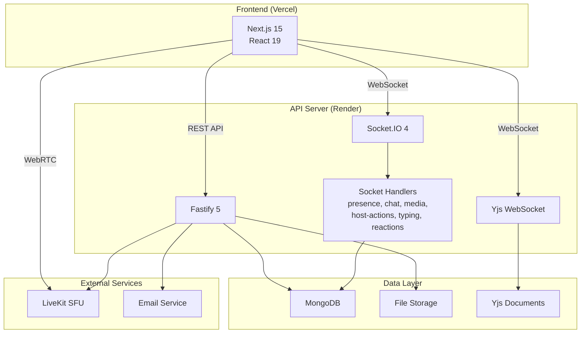
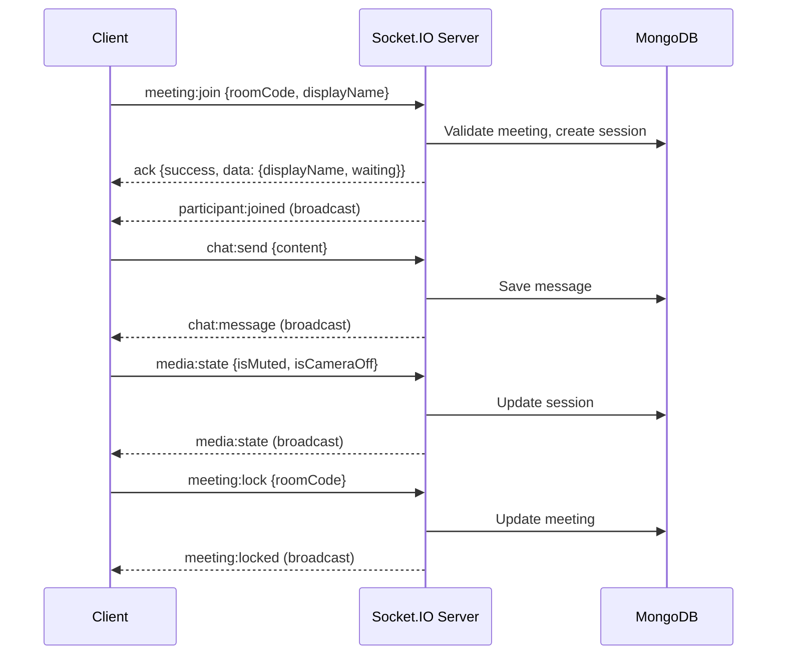
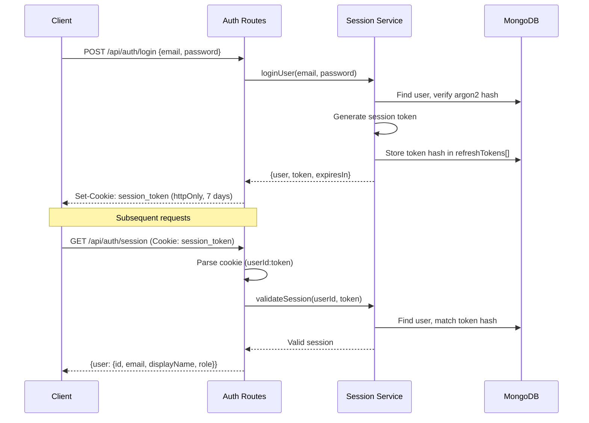

<div align="center">

# SyncSpace

**Real-time collaborative meeting platform with HD video, screen sharing, live chat, collaborative editing, and file sharing.**

Built with Next.js 15, Fastify 5, Socket.IO, LiveKit WebRTC, and MongoDB — deployed as a production-grade monorepo.

[](LICENSE)
[](https://nodejs.org)
[](https://pnpm.io)
[](https://typescriptlang.org)
[](https://turbo.build)

</div>

---

## Overview

SyncSpace is a full-stack video conferencing platform designed for teams that need more than just video calls. It combines **HD video/audio** via LiveKit WebRTC, **real-time messaging** via Socket.IO, **collaborative document editing** via Yjs, and **file sharing** — all in a single, self-hosted meeting room.

Built as a **pnpm monorepo** with Turborepo, the codebase is split into shared packages (`types`, `validation`, `config`) and two applications (`web`, `api`) with clean separation of concerns.

### Why SyncSpace?

- **No vendor lock-in** — self-hostable with Docker, deployable to Vercel + Render
- **Zoom-like experience** — waiting room, host controls, mute-all, co-hosts, role management
- **Collaborative by default** — real-time shared notes, file sharing, and typing indicators
- **Type-safe end-to-end** — shared TypeScript types and Zod validation between client and server
- **Production-ready** — session auth, rate limiting, input sanitization, structured logging

---

## Features

### Video & Audio

| Feature            | Details                                                       |
| :----------------- | :------------------------------------------------------------ |
| HD Video Calls     | WebRTC via LiveKit SFU with adaptive stream and dynacast      |
| Screen Sharing     | Native browser screen capture with dedicated tile display     |
| Device Selection   | Choose camera, microphone, and speaker from available devices |
| Audio/Video Toggle | Per-participant mic and camera controls                       |
| Adaptive Quality   | LiveKit dynamically adjusts stream quality based on bandwidth |

### Meeting Management

| Feature              | Details                                                                    |
| :------------------- | :------------------------------------------------------------------------- |
| Create/Join Meetings | Instant meeting creation with 8-character room codes                       |
| Waiting Room         | Host-controlled admission for external participants                        |
| Meeting Lock         | Prevent new participants from joining                                      |
| Host Transfer        | Transfer host privileges to another participant                            |
| Co-Host Roles        | Promote/demote co-hosts with partial admin privileges                      |
| Mute All             | Host can mute all participants simultaneously                              |
| Participant Removal  | Force-remove participants from the meeting                                 |
| Meeting End          | Host can end the meeting for all participants                              |
| Meeting Settings     | Configurable: mute-on-join, camera-off, participant unmute/cam permissions |

### Real-Time Communication

| Feature           | Details                                                         |
| :---------------- | :-------------------------------------------------------------- |
| Live Chat         | Persistent text messages with sender attribution and timestamps |
| Typing Indicators | See when other participants are typing                          |
| Reactions         | Emoji reactions (thumbs up, clap, laugh, surprise, heart)       |
| Hand Raise        | Visual signal for wanting to speak                              |
| System Messages   | Join/leave/role-change notifications in chat                    |

### Collaboration

| Feature             | Details                                                              |
| :------------------ | :------------------------------------------------------------------- |
| Collaborative Notes | Real-time shared notepad powered by Yjs CRDT with cursor presence    |
| File Sharing        | Upload, download, and manage files within meetings (50MB limit)      |
| Participant Panel   | Searchable list with role badges, waiting room, and per-user actions |

### Authentication & Security

| Feature            | Details                                                    |
| :----------------- | :--------------------------------------------------------- |
| Registration       | Email + password with verification email                   |
| Session Auth       | httpOnly cookies with token rotation                       |
| Password Reset     | Secure token-based reset with 15-minute expiry             |
| Argon2 Hashing     | Memory-hard password hashing (argon2id)                    |
| Rate Limiting      | 120 req/min globally, 10 req/min on auth endpoints         |
| Input Sanitization | NoSQL injection prevention via mongo-sanitize              |
| Zod Validation     | Server-side validation on all API inputs and socket events |

### User Interface

| Feature              | Details                                               |
| :------------------- | :---------------------------------------------------- |
| Dark Theme           | Custom design system with purple + teal palette       |
| Responsive Layout    | Works on desktop and tablet viewports                 |
| Gallery/Speaker View | Toggle between grid and active-speaker layouts        |
| Side Panels          | Participants, chat, files, notes, and settings panels |
| Fullscreen Mode      | Immersive meeting view                                |
| Animated Transitions | Smooth layout animations with Motion (Framer Motion)  |
| Toast Notifications  | Non-intrusive feedback via Sonner                     |

---

## Live Demo

| Environment  | URL                                            |
| :----------- | :--------------------------------------------- |
| Frontend     | https://sync-space-api.vercel.app              |
| API          | https://syncspace-1bop.onrender.com            |
| Health Check | https://syncspace-1bop.onrender.com/api/health |

> The Render free tier may take 30-60 seconds to wake up from cold start.

---

## Tech Stack

### Core

| Layer           | Technology | Version |
| :-------------- | :--------- | :------ |
| Language        | TypeScript | 5.7     |
| Runtime         | Node.js    | >= 20   |
| Package Manager | pnpm       | 10.7    |
| Monorepo        | Turborepo  | 2.4     |

### Frontend (`apps/web`)

| Category     | Technology              | Purpose                                 |
| :----------- | :---------------------- | :-------------------------------------- |
| Framework    | Next.js 15 (App Router) | React framework with SSR/SSG            |
| UI Library   | React 19                | Component rendering                     |
| Styling      | Tailwind CSS v4         | Utility-first CSS with CSS-native theme |
| State        | Zustand 5               | Client-side state management            |
| Server State | React Query 5           | API data fetching and caching           |
| Forms        | react-hook-form + Zod   | Form handling and validation            |
| Video        | LiveKit Components      | WebRTC video/audio                      |
| Real-time    | Socket.IO Client        | Bidirectional event communication       |
| Collab       | Yjs + y-websocket       | CRDT-based collaborative editing        |
| Animations   | Motion (Framer Motion)  | Declarative animations                  |
| Icons        | lucide-react            | Icon library                            |
| Toasts       | Sonner                  | Notification toasts                     |

### Backend (`apps/api`)

| Category   | Technology                      | Purpose                                 |
| :--------- | :------------------------------ | :-------------------------------------- |
| Framework  | Fastify 5                       | High-performance HTTP server            |
| Database   | MongoDB 7 + Mongoose 8          | Document database with ODM              |
| Real-time  | Socket.IO 4                     | WebSocket event server                  |
| Collab     | Yjs + ws                        | CRDT WebSocket server                   |
| Video      | LiveKit Server SDK              | WebRTC token generation                 |
| Auth       | Argon2 + httpOnly cookies       | Password hashing and session management |
| Email      | Nodemailer                      | Transactional email sending             |
| Validation | Zod                             | Runtime schema validation               |
| Logging    | Pino                            | Structured JSON logging                 |
| Security   | @fastify/helmet, mongo-sanitize | Headers and injection prevention        |

### Shared Packages

| Package                 | Purpose                                                |
| :---------------------- | :----------------------------------------------------- |
| `@syncspace/types`      | TypeScript interfaces shared between client and server |
| `@syncspace/validation` | Zod schemas for API and socket event validation        |
| `@syncspace/config`     | Shared TypeScript configurations                       |

### Infrastructure

| Service       | Purpose                                 |
| :------------ | :-------------------------------------- |
| Vercel        | Frontend deployment (Next.js)           |
| Render        | API deployment (Fastify + Socket.IO)    |
| MongoDB Atlas | Cloud database (or local MongoDB 7)     |
| LiveKit Cloud | WebRTC SFU for video/audio              |
| Docker        | Alternative local/production deployment |

---

## Architecture

### System Architecture



### Socket.IO Event Flow



### Authentication Flow



---

## Folder Structure

```
syncspace/
├── apps/
│   ├── web/                          # Next.js 15 frontend
│   │   ├── src/
│   │   │   ├── app/                  # App Router pages
│   │   │   │   ├── (auth)/           # Auth pages (login, register)
│   │   │   │   ├── (dashboard)/      # Dashboard layout + page
│   │   │   │   ├── meeting/
│   │   │   │   │   ├── prejoin/      # Pre-join lobby
│   │   │   │   │   └── room/         # Active meeting room
│   │   │   │   ├── layout.tsx        # Root layout (providers, toasts)
│   │   │   │   ├── page.tsx          # Landing page
│   │   │   │   └── globals.css       # Tailwind v4 theme
│   │   │   ├── components/           # React components
│   │   │   │   ├── meeting/          # Meeting UI components
│   │   │   │   ├── collaborative-pad.tsx  # Yjs shared editor
│   │   │   │   ├── files-panel.tsx   # File sharing panel
│   │   │   │   └── providers.tsx     # React Query provider
│   │   │   ├── hooks/                # Custom React hooks
│   │   │   ├── stores/               # Zustand state stores
│   │   │   └── lib/                  # Utilities (API client, Socket.IO, LiveKit)
│   │   ├── next.config.ts            # Standalone output, dev proxy
│   │   └── .env.local                # Local environment variables
│   │
│   └── api/                          # Fastify 5 backend
│       └── src/
│           ├── app.ts                # Entrypoint (plugins, routes, Socket.IO)
│           ├── lib/                  # Config, database, logger, errors, email
│           ├── models/               # Mongoose schemas (8 models)
│           ├── modules/              # Feature modules (auth, meeting, chat, etc.)
│           ├── plugins/              # Fastify plugins (auth, CORS, rate-limit, etc.)
│           ├── socket/               # Socket.IO server + event handlers
│           └── collab/               # Yjs WebSocket collaboration server
│
├── packages/
│   ├── types/                        # Shared TypeScript interfaces
│   ├── validation/                   # Shared Zod validation schemas
│   └── config/                       # Shared TypeScript configurations
│
├── docker/                           # Docker deployment files
│   ├── Dockerfile.api
│   ├── Dockerfile.web
│   └── docker-compose.yml
│
├── turbo.json                        # Turborepo task configuration
├── pnpm-workspace.yaml               # pnpm workspace definition
├── render.yaml                       # Render deployment blueprint
└── package.json                      # Root scripts and dev dependencies
```

---

## Installation

### Prerequisites

- **Node.js** >= 20
- **pnpm** >= 10 (enforced via Corepack)
- **MongoDB** instance (local or Atlas)
- **LiveKit** account (for video/audio)

### Clone and Install

```bash
git clone https://github.com/limon-l/syncspace.git
cd syncspace
pnpm install
```

### Environment Variables

Create the required environment files:

```bash
# Backend (apps/api/.env)
cp apps/api/.env.example apps/api/.env

# Frontend (apps/web/.env.local)
cp apps/web/.env.example apps/web/.env.local
```

Fill in the values — see the [Environment Variables](#environment-variables) section below.

### Development

```bash
# Start all services (web + API) with hot reload
pnpm dev
```

This starts:

- **Frontend** at `http://localhost:3000`
- **API** at `http://localhost:4000`

The frontend automatically proxies `/api/*`, `/socket.io/*`, and `/collab/*` to the API in development.

### Production Build

```bash
pnpm build        # Build all packages and apps
pnpm --filter @syncspace/api start    # Start API server
pnpm --filter @syncspace/web start    # Start Next.js server
```

### Docker

```bash
docker compose -f docker/docker-compose.yml up --build
```

This starts MongoDB, the API, and the frontend in containers.

---

## Environment Variables

### Frontend (`apps/web/.env.local`)

| Variable                  | Required   | Description                                                                              |
| :------------------------ | :--------- | :--------------------------------------------------------------------------------------- |
| `NEXT_PUBLIC_API_URL`     | Yes (prod) | Backend API URL (e.g., `https://your-api.onrender.com`). Omit in dev to use local proxy. |
| `NEXT_PUBLIC_SOCKET_URL`  | Yes (prod) | Socket.IO server URL. Usually same as `NEXT_PUBLIC_API_URL`.                             |
| `NEXT_PUBLIC_LIVEKIT_URL` | Yes        | LiveKit server URL (e.g., `wss://your-project.livekit.cloud`).                           |
| `NEXT_PUBLIC_COLLAB_URL`  | Yes (prod) | Yjs WebSocket collab URL (e.g., `wss://your-api.onrender.com/collab`).                   |

### Backend (`apps/api/.env`)

| Variable             | Required | Description                                                                                     |
| :------------------- | :------- | :---------------------------------------------------------------------------------------------- |
| `NODE_ENV`           | No       | `development` or `production`. Default: `development`.                                          |
| `PORT`               | No       | Server port. Default: `4000`.                                                                   |
| `MONGODB_URI`        | Yes      | MongoDB connection string (e.g., `mongodb+srv://...` or `mongodb://localhost:27017/syncspace`). |
| `SESSION_SECRET`     | Yes      | Secret for signing session cookies. Minimum 32 characters.                                      |
| `CORS_ORIGIN`        | No       | Comma-separated allowed origins. Default: `http://localhost:3000`.                              |
| `APP_URL`            | No       | Frontend URL for email links. Default: `http://localhost:3000`.                                 |
| `SMTP_HOST`          | No       | SMTP server host for email sending. Falls back to console logging in dev.                       |
| `SMTP_PORT`          | No       | SMTP server port (typically 587 or 465).                                                        |
| `SMTP_USER`          | No       | SMTP authentication username.                                                                   |
| `SMTP_PASS`          | No       | SMTP authentication password.                                                                   |
| `LIVEKIT_URL`        | No       | LiveKit server URL for token generation.                                                        |
| `LIVEKIT_API_KEY`    | No       | LiveKit API key.                                                                                |
| `LIVEKIT_API_SECRET` | No       | LiveKit API secret for token signing.                                                           |

> Never commit `.env` files to version control. All env files are gitignored.

---

## Available Scripts

### Root

| Script              | Description                                          |
| :------------------ | :--------------------------------------------------- |
| `pnpm dev`          | Start all apps in development mode with Turborepo    |
| `pnpm build`        | Build all packages and apps (topological order)      |
| `pnpm lint`         | Run ESLint across all packages                       |
| `pnpm typecheck`    | Run TypeScript type checking across all packages     |
| `pnpm test`         | Run tests across all packages                        |
| `pnpm clean`        | Remove `dist`, `.next`, `.turbo`, and `node_modules` |
| `pnpm format`       | Format code with Prettier                            |
| `pnpm vercel-build` | Build only the web app (for Vercel deployment)       |

### Frontend (`apps/web`)

| Script           | Description                                                |
| :--------------- | :--------------------------------------------------------- |
| `pnpm dev`       | Start Next.js dev server on port 3000                      |
| `pnpm build`     | Production build (ensures shared packages are built first) |
| `pnpm start`     | Start production Next.js server                            |
| `pnpm lint`      | Run Next.js linting                                        |
| `pnpm typecheck` | TypeScript type checking                                   |

### Backend (`apps/api`)

| Script            | Description                                  |
| :---------------- | :------------------------------------------- |
| `pnpm dev`        | Start Fastify with tsx watch (hot reload)    |
| `pnpm build`      | Compile TypeScript to `dist/`                |
| `pnpm start`      | Start production server (`node dist/app.js`) |
| `pnpm lint`       | Run ESLint on source files                   |
| `pnpm typecheck`  | TypeScript type checking                     |
| `pnpm test`       | Run Vitest test suite                        |
| `pnpm test:watch` | Run tests in watch mode                      |

---

## API Documentation

### Base URL

| Environment | URL                                   |
| :---------- | :------------------------------------ |
| Development | `http://localhost:4000`               |
| Production  | `https://syncspace-1bop.onrender.com` |

### Health Check

```
GET /api/health
```

```json
{
  "status": "ok",
  "timestamp": "2025-07-14T12:00:00.000Z"
}
```

### Authentication

All protected endpoints require a `session_token` httpOnly cookie, set upon login.

### Auth Endpoints

| Method | Endpoint                          | Rate Limit | Description             |
| :----- | :-------------------------------- | :--------- | :---------------------- |
| `POST` | `/api/auth/register`              | 10/min     | Register new account    |
| `GET`  | `/api/auth/verify-email/:token`   | —          | Verify email address    |
| `POST` | `/api/auth/login`                 | 10/min     | Log in                  |
| `POST` | `/api/auth/logout`                | —          | Log out (clears cookie) |
| `GET`  | `/api/auth/session`               | 30/min     | Get current session     |
| `POST` | `/api/auth/refresh`               | —          | Refresh session token   |
| `POST` | `/api/auth/forgot-password`       | 10/min     | Request password reset  |
| `POST` | `/api/auth/reset-password/:token` | 10/min     | Reset password          |

**Register**

```json
POST /api/auth/register
{
  "email": "user@example.com",
  "password": "SecurePass1",
  "displayName": "John Doe"
}
```

**Login**

```json
POST /api/auth/login
{
  "email": "user@example.com",
  "password": "SecurePass1"
}
```

Response sets `session_token` cookie and returns user profile.

### Meeting Endpoints

| Method | Endpoint                       | Auth | Description                     |
| :----- | :----------------------------- | :--- | :------------------------------ |
| `POST` | `/api/meetings`                | Yes  | Create a new meeting            |
| `GET`  | `/api/meetings/history`        | Yes  | Get meeting history (last 50)   |
| `GET`  | `/api/meetings/:roomCode`      | No   | Get meeting info                |
| `POST` | `/api/meetings/:roomCode/join` | Yes  | Join a meeting                  |
| `POST` | `/api/meetings/:roomCode/end`  | Yes  | End meeting (host only)         |
| `POST` | `/api/meetings/:roomCode/lock` | Yes  | Lock/unlock meeting (host only) |

### Chat Endpoints

| Method | Endpoint                                 | Auth | Description                      |
| :----- | :--------------------------------------- | :--- | :------------------------------- |
| `GET`  | `/api/meetings/:roomCode/messages?page=` | Yes  | Paginated chat history (50/page) |

### File Endpoints

| Method   | Endpoint                                | Auth | Description                       |
| :------- | :-------------------------------------- | :--- | :-------------------------------- |
| `POST`   | `/api/meetings/:roomCode/files`         | Yes  | Upload file (multipart, 50MB max) |
| `GET`    | `/api/meetings/:roomCode/files`         | Yes  | List files                        |
| `GET`    | `/api/meetings/:roomCode/files/:fileId` | Yes  | Download file                     |
| `DELETE` | `/api/meetings/:roomCode/files/:fileId` | Yes  | Delete file (uploader only)       |

### LiveKit Endpoints

| Method | Endpoint                       | Auth | Description                  |
| :----- | :----------------------------- | :--- | :--------------------------- |
| `GET`  | `/api/livekit/token/:roomName` | Yes  | Generate WebRTC access token |

### User Endpoints

| Method  | Endpoint               | Auth | Description              |
| :------ | :--------------------- | :--- | :----------------------- |
| `GET`   | `/api/users/me`        | Yes  | Get current user profile |
| `PATCH` | `/api/users/me`        | Yes  | Update display name      |
| `GET`   | `/api/users/search?q=` | Yes  | Search users by name     |

### Socket.IO Events

The server uses Socket.IO for real-time bidirectional communication. All connections are authenticated via session cookie.

**Client → Server Events:**

| Event                    | Payload                            | Description                    |
| :----------------------- | :--------------------------------- | :----------------------------- |
| `meeting:join`           | `{roomCode, displayName}`          | Join a meeting room            |
| `meeting:leave`          | `{roomCode}`                       | Leave a meeting room           |
| `chat:send`              | `{roomCode, content}`              | Send a chat message            |
| `chat:typing-start`      | `{roomCode}`                       | Start typing indicator         |
| `chat:typing-stop`       | `{roomCode}`                       | Stop typing indicator          |
| `reaction:send`          | `{roomCode, reaction}`             | Send an emoji reaction         |
| `hand:raise`             | `{roomCode}`                       | Raise hand                     |
| `hand:lower`             | `{roomCode}`                       | Lower hand                     |
| `media:state`            | `{roomCode, isMuted, isCameraOff}` | Update media state             |
| `participant:mute`       | `{roomCode, userId}`               | Mute a participant (host)      |
| `participant:remove`     | `{roomCode, userId}`               | Remove participant (host)      |
| `participant:admit`      | `{roomCode, userId}`               | Admit from waiting room (host) |
| `participant:deny`       | `{roomCode, userId}`               | Deny from waiting room (host)  |
| `meeting:lock`           | `{roomCode}`                       | Lock meeting (host)            |
| `meeting:unlock`         | `{roomCode}`                       | Unlock meeting (host)          |
| `meeting:mute-all`       | `{roomCode}`                       | Mute all (host)                |
| `meeting:transfer-host`  | `{roomCode, userId}`               | Transfer host role             |
| `meeting:promote-cohost` | `{roomCode, userId}`               | Promote to co-host             |
| `meeting:demote-cohost`  | `{roomCode, userId}`               | Demote co-host                 |
| `meeting:end`            | `{roomCode}`                       | End meeting for all (host)     |

**Server → Client Events:**

| Event                         | Data                                                    | Description                 |
| :---------------------------- | :------------------------------------------------------ | :-------------------------- |
| `participant:joined`          | `{userId, displayName, role, ...}`                      | New participant joined      |
| `participant:left`            | `{userId}`                                              | Participant left            |
| `participant:muted`           | `{userId}`                                              | Participant was muted       |
| `participant:unmuted`         | `{userId}`                                              | Participant was unmuted     |
| `participant:removed`         | `{userId}`                                              | You were removed            |
| `participant:role-changed`    | `{userId, role}`                                        | Participant role updated    |
| `participant:hand-raised`     | `{userId}`                                              | Hand raised                 |
| `participant:hand-lowered`    | `{userId}`                                              | Hand lowered                |
| `chat:message`                | `{messageId, senderId, senderName, content, createdAt}` | New chat message            |
| `chat:typing`                 | `{userId, displayName}`                                 | User is typing              |
| `chat:stopped-typing`         | `{userId}`                                              | User stopped typing         |
| `reaction:received`           | `{userId, displayName, reaction}`                       | Reaction received           |
| `media:state`                 | `{userId, isMuted, isCameraOff}`                        | Media state changed         |
| `meeting:locked`              | —                                                       | Meeting was locked          |
| `meeting:unlocked`            | —                                                       | Meeting was unlocked        |
| `meeting:ended`               | —                                                       | Meeting was ended by host   |
| `meeting:muted-all`           | —                                                       | All participants muted      |
| `meeting:settings-changed`    | `{settings}`                                            | Meeting settings updated    |
| `meeting:waiting-participant` | `{userId, displayName, joinedAt}`                       | Participant in waiting room |

---

## Database

### Technology

- **Database:** MongoDB 7
- **ODM:** Mongoose 8

### Schema Overview

| Model                | Description                     | Key Indexes                                                           |
| :------------------- | :------------------------------ | :-------------------------------------------------------------------- |
| `User`               | User accounts with auth fields  | `email` (unique), `emailVerificationToken`, `refreshTokens.tokenHash` |
| `Meeting`            | Meeting instances with settings | `roomCode` (unique), `hostId`, `status`, `participantIds`             |
| `ParticipantSession` | Active participant tracking     | `(meetingId, userId)`, `(meetingId, role)`, `(userId, leftAt)`        |
| `Message`            | Chat messages                   | `(meetingId, createdAt)`, `senderId`                                  |
| `SharedFile`         | Uploaded files metadata         | `meetingId`                                                           |
| `Invitation`         | Meeting invitations             | `token`, `meetingId`, TTL on `expiresAt`                              |
| `Notification`       | User notifications              | `(userId, createdAt)`, `(userId, isRead)`                             |
| `AuditLog`           | Security audit trail            | `(meetingId, createdAt)`, `(actorId, createdAt)`                      |

### Relationships

```
User 1────N ParticipantSession N────1 Meeting
User 1────N Message N────1 Meeting
User 1────N SharedFile N────1 Meeting
User 1────N AuditLog
Meeting 1────N Invitation
User 1────N Notification
```

---

## Authentication

### How It Works

1. **Registration** — User submits email, password, and display name. Password is hashed with argon2id. A verification email is sent with a 24-hour token.

2. **Login** — Credentials are validated against the argon2id hash. A session token is generated (32 random bytes), hashed with SHA-256, and stored in the `refreshTokens[]` array on the user document. An httpOnly cookie (`session_token`) is set with the format `userId:token` (7-day expiry).

3. **Session Validation** — Every request passes through the auth plugin, which parses the cookie, extracts the userId and token, hashes the token, and matches it against stored refresh tokens.

4. **Token Rotation** — Session tokens are rotated on refresh. Each user can have up to 10 active sessions; older sessions are trimmed to 5.

5. **Password Reset** — A time-limited token (15 minutes) is emailed. On reset, all existing refresh tokens are invalidated.

### Session Cookie Configuration

| Property   | Development | Production |
| :--------- | :---------- | :--------- |
| `httpOnly` | `true`      | `true`     |
| `secure`   | `false`     | `true`     |
| `sameSite` | `lax`       | `none`     |
| `maxAge`   | 7 days      | 7 days     |
| `path`     | `/`         | `/`        |

---

## Deployment

### Vercel (Frontend)

1. Connect your GitHub repository to Vercel
2. Set the **root directory** to `apps/web`
3. Set the **build command** to `cd ../.. && pnpm vercel-build`
4. Set the **output directory** to `.next`
5. Add environment variables in the Vercel dashboard:
   - `NEXT_PUBLIC_API_URL` → Your Render API URL
   - `NEXT_PUBLIC_SOCKET_URL` → Your Render API URL
   - `NEXT_PUBLIC_LIVEKIT_URL` → Your LiveKit WebSocket URL
   - `NEXT_PUBLIC_COLLAB_URL` → Your Render collab URL (`wss://...onrender.com/collab`)
6. Deploy

### Render (API)

1. Use the included `render.yaml` blueprint or create a manual **Web Service**
2. **Build command:** `pnpm install && npx turbo build --filter=@syncspace/api`
3. **Start command:** `node apps/api/dist/app.js`
4. **Health check path:** `/api/health`
5. Set environment variables in the Render dashboard (see [Environment Variables](#environment-variables))
6. Deploy

### Docker (Full Stack)

```bash
# Build and start all services
docker compose -f docker/docker-compose.yml up --build

# Services:
# - MongoDB:   localhost:27017
# - API:       localhost:4000
# - Frontend:  localhost:3000
```

Volumes persist MongoDB data, uploaded files, and Yjs documents.

---

## Performance Optimizations

| Optimization            | Implementation                                                           |
| :---------------------- | :----------------------------------------------------------------------- |
| Monorepo Caching        | Turborepo caches build outputs and task results                          |
| Topological Builds      | Shared packages build once, consumed by both apps                        |
| Next.js Standalone      | Self-contained Node.js server for Docker (smaller image)                 |
| LiveKit Adaptive Stream | Automatically adjusts video quality per bandwidth                        |
| LiveKit Dynacast        | Stops sending video tracks not being viewed                              |
| Memoized Components     | `React.memo` on video tiles and panels to prevent unnecessary re-renders |
| Zustand Selectors       | Granular state subscriptions avoid full-store re-renders                 |
| React Query Stale Time  | 60-second stale time reduces redundant API calls                         |
| Lazy Reconnection       | Socket.IO exponential backoff (1s-10s) with infinite retries             |
| Structured Logging      | Pino JSON logging (debug in dev, info in production)                     |
| MongoDB Indexes         | Targeted indexes on all frequently queried fields                        |
| TTL Indexes             | Automatic cleanup of expired sessions, invitations, and meetings         |

---

## Security

| Feature                    | Implementation                                                       |
| :------------------------- | :------------------------------------------------------------------- |
| Password Hashing           | argon2id with 65536 memory, 3 iterations, 4 parallelism              |
| Session Management         | httpOnly cookies with SHA-256 token hashing, 7-day expiry, rotation  |
| Rate Limiting              | 120 req/min global, 10 req/min on auth endpoints                     |
| Input Validation           | Zod schemas on all API inputs and socket event payloads              |
| NoSQL Injection Prevention | mongo-sanitize strips `$`-prefixed keys and MongoDB operators        |
| CORS Policy                | Explicit origin whitelist + wildcard Vercel preview domains          |
| Security Headers           | @fastify/helmet for HTTP security headers                            |
| Cookie Security            | `secure: true` + `sameSite: none` in production                      |
| Auth Guards                | `requireAuth` Fastify preHandler + Socket.IO cookie-based middleware |
| Role-Based Access          | Host/co-host/participant permissions enforced server-side            |
| Token Expiry               | Email verification (24h), password reset (15min)                     |
| Session Limits             | Max 10 active sessions per user, trimmed to 5                        |

---

## Contributing

Contributions are welcome! Here's how to get started:

1. **Fork** the repository
2. **Clone** your fork: `git clone https://github.com/limon-l/syncspace.git`
3. **Install** dependencies: `pnpm install`
4. **Create** a feature branch: `git checkout -b feature/amazing-feature`
5. **Make** your changes
6. **Typecheck**: `pnpm typecheck`
7. **Test**: `pnpm test`
8. **Commit**: `git commit -m "feat: add amazing feature"`
9. **Push**: `git push origin feature/amazing-feature`
10. **Open** a Pull Request

### Commit Convention

This project follows [Conventional Commits](https://www.conventionalcommits.org/):

- `feat:` — New feature
- `fix:` — Bug fix
- `docs:` — Documentation changes
- `style:` — Code style changes (formatting, etc.)
- `refactor:` — Code refactoring
- `test:` — Adding or updating tests
- `chore:` — Maintenance tasks

---

## Roadmap

### Completed

- [x] User registration and authentication
- [x] Email verification and password reset
- [x] Meeting creation with unique room codes
- [x] HD video/audio via LiveKit WebRTC
- [x] Screen sharing with dedicated tile
- [x] Real-time chat with typing indicators
- [x] Emoji reactions
- [x] Hand raise
- [x] Waiting room with host admission
- [x] Meeting lock/unlock
- [x] Host transfer
- [x] Co-host roles (promote/demote)
- [x] Mute all participants
- [x] Participant removal
- [x] Collaborative notes (Yjs CRDT)
- [x] File sharing with upload/download
- [x] Meeting settings (mute-on-join, camera-off, etc.)
- [x] Gallery/speaker view toggle
- [x] Device selection (camera, mic, speaker)
- [x] Fullscreen mode
- [x] Meeting history
- [x] Docker deployment
- [x] Vercel + Render deployment

### Planned

- [ ] Meeting scheduling with calendar integration
- [ ] Virtual backgrounds
- [ ] Breakout rooms
- [ ] Meeting recording
- [ ] End-to-end encryption
- [ ] Whiteboard
- [ ] Polls and Q&A
- [ ] Mobile-responsive bottom sheet panels
- [ ] Accessibility audit (WCAG 2.1 AA)
- [ ] End-to-end test suite
- [ ] CI/CD pipeline with GitHub Actions
- [ ] Push notifications for meeting invites

---

## License

This project is licensed under the **MIT License**. See the [LICENSE](LICENSE) file for details.

---

## Author

**Limon Roy Apu**

- GitHub: [@limon-l](https://github.com/limon-l)
- LinkedIn: [Limon Roy Apu](https://linkedin.com/in/limonroyapu)
- Portfolio: [Portfolio - Limon](https://my-profile-green-beta.vercel.app)
- Email: limonroyapu101@gmail.com

---

## Acknowledgements

| Library                                       | Purpose                            |
| :-------------------------------------------- | :--------------------------------- |
| [Next.js](https://nextjs.org)                 | React framework for production     |
| [Fastify](https://fastify.io)                 | High-performance HTTP server       |
| [MongoDB](https://mongodb.com)                | Document database                  |
| [Mongoose](https://mongoosejs.com)            | MongoDB ODM                        |
| [Socket.IO](https://socket.io)                | Real-time bidirectional events     |
| [LiveKit](https://livekit.io)                 | Open-source WebRTC SFU             |
| [Yjs](https://yjs.dev)                        | CRDT for collaborative editing     |
| [Zustand](https://github.com/pmndrs/zustand)  | Lightweight state management       |
| [React Query](https://tanstack.com/query)     | Server state management            |
| [Tailwind CSS](https://tailwindcss.com)       | Utility-first CSS framework        |
| [Zod](https://zod.dev)                        | TypeScript-first schema validation |
| [Argon2](https://github.com/nickvdyck/argon2) | Memory-hard password hashing       |
| [Turborepo](https://turbo.build)              | Monorepo build system              |
| [Pino](https://getpino.io)                    | Fast JSON logger                   |
| [Motion](https://motion.dev)                  | Animation library for React        |
| [Sonner](https://sonner.emilkowal.dev)        | Toast notifications                |
| [Lucide](https://lucide.dev)                  | Beautiful icons                    |
